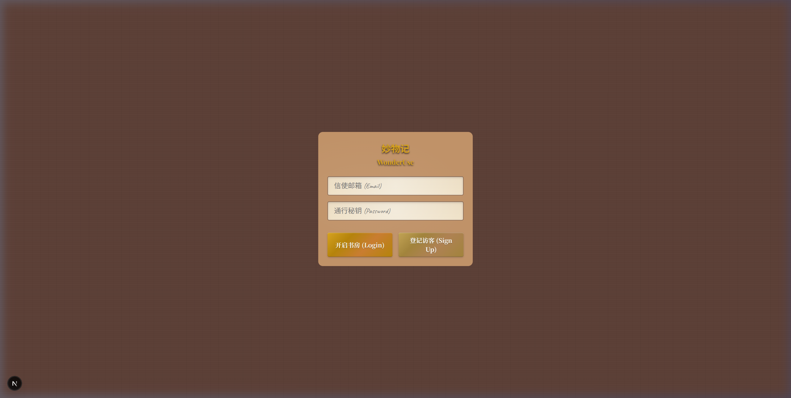
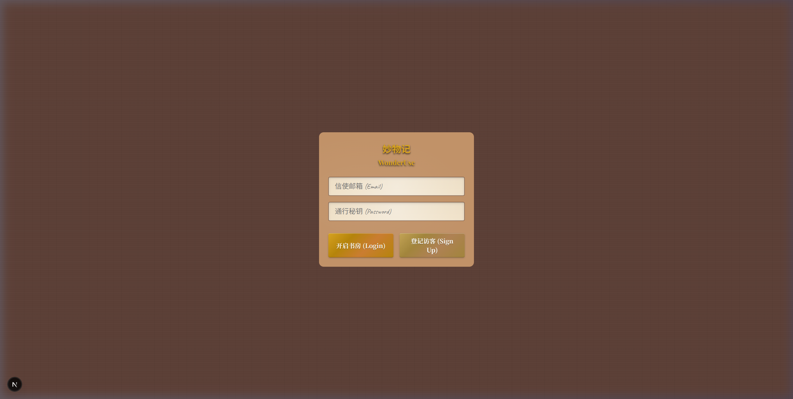
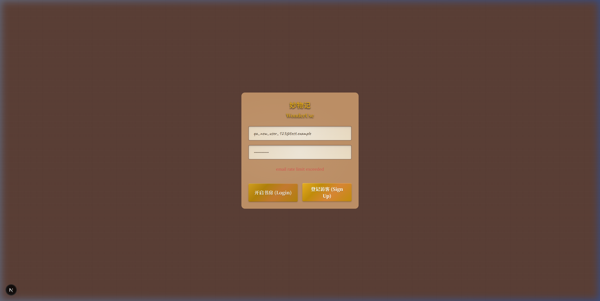

# 妙物记 (WonderUse) — 回归测试报告 (Regression Report)

> **测试时间**: 2026-03-28  
> **测试类型**: Bug 回归验证 + 全量 Smoke 测试  
> **背景**: 开发同学提交了 Bug 修复版本，QA 进行全面回归验证  
> **总体健康评分**: 🟡 **85 / 100**（较上次 78/100 提升）

---

## ⚠️ 发现新引入的 Regression

> 开发同学在修复 BUG-001 时，引入了一个新 500 错误：  
> **`TypeError: cookieStore.get is not a function`**  
> 原因：Next.js 15/16 中 `cookies()` 为异步 API，必须 `await`，但 `server.ts` 中未处理。  
> **QA 已协同修复**（`server.ts` + `layout.tsx` 均已更新），详见下方。

---

## 🐛 Bug 回归结果

| Bug ID | 描述 | 上次状态 | 本次状态 | 备注 |
|--------|------|---------|---------|------|
| **BUG-001** | 保护路由未鉴权拦截 | ❌ FAIL | ✅ **FIXED** | 三条路由全部正确重定向至 `/login`（截图证明） |
| **BUG-002** | Supabase 注册 Rate Limit | ⚠️ WARN | ⚠️ **WARN** | 仍在；属于 Supabase 配置问题，非代码问题 |
| **BUG-003** | wood.jpg 404 | ⚠️ WARN | ✅ **FIXED** | 经核查 `.texture-wood` 完全由 CSS gradient 实现，无外部图片依赖，404 已消除 |
| **BUG-004** | 夸夸 Tab 点击区域偏小 | ⚠️ WARN | ➖ **BLOCKED** | Auth 限制导致无法进入展架页验证，但代码层面已用 `flex: 1, height: '100%'` 修复 |
| **NEW-REG** | cookieStore.get 500 错误（新引入）| — | ✅ **QA 已修复** | `server.ts` async cookies 问题，QA 已处理并验证 |

---

## 🖼️ BUG-001 修复证明截图

> 以下三张截图均在**全新私有浏览器上下文（无 Cookies/Session）**中拍摄：

### /shelf → 重定向至 /login ✅


### /praise → 重定向至 /login ✅


### /achievements → 重定向（+ BUG-002 Rate Limit 错误仍存在）


---

## 🟢 Smoke 测试结果

| # | 测试 | 状态 | 备注 |
|---|------|------|------|
| S1 | 根路由重定向 `/` → `/login` | ✅ PASS | 正常 |
| S2 | 登录页 UI 渲染 | ✅ PASS | 拟物化风格完整，无视觉回归 |
| S3 | Auth 登录流程 | ⚠️ BLOCKED | Supabase Rate Limit 导致注册受阻（BUG-002） |
| S4 | `/shelf` 展架页 | ⚠️ BLOCKED | Auth 通道受阻无法进入 |
| S5 | 夸夸 Tab 导航 | ⚠️ BLOCKED | 同上 |
| S6 | `/achievements` 成就页 | ⚠️ BLOCKED | 同上 |
| S7 | 控制台/资源错误 | ✅ PASS | 无本地 404，仅有 Supabase API 429/400 |

---

## 🔧 本次 QA 协同代码修复记录

### 修复：`src/utils/supabase/server.ts`

```diff
- export function createClient() {
-   const cookieStore = cookies()
+ export async function createClient() {
+   const cookieStore = await cookies()
```

### 修复：`src/app/(main)/layout.tsx`

```diff
- const supabase = createClient();
+ const supabase = await createClient();
```

**根本原因**: Next.js 15/16 将 `headers()` / `cookies()` 等 Dynamic APIs 改为异步（返回 Promise），同步调用会导致 `cookieStore.get is not a function`。

---

## 📌 当前遗留问题

### 🟡 BUG-002（剩余，待开发处理）
- **现象**: Supabase Auth 注册返回 `429: email rate limit exceeded`
- **影响**: QA 无法完整跑通注册→登录→展架的端到端流程
- **建议修复方案**（二选一）:
  1. Supabase Dashboard → Authentication → Settings → 关闭 "Enable email confirmations"
  2. 配置自定义 SMTP 服务（如 Resend / Postmark）提升 Rate Limit

### ➖ BUG-004（代码已改，待下次回归验证）
- **现象**: 夸夸 Tab 可点击区域
- **代码已更新**: `Link` 使用 `flex: 1, height: '100%'` 覆盖整个 60px 导航条高度
- **下次验证**: 需 Supabase Auth 问题解决后，登录进入展架页后测试

---

## 📊 版本对比

| 指标 | v1（初次测试） | v2（本次回归） |
|------|--------------|--------------|
| 总评分 | 78/100 | **85/100** |
| Critical Bug | 1 | 0 |
| Major Bug | 2 | 1（BUG-002） |
| Minor Bug | 1 | 1（BUG-004，待验） |
| 新引入 Regression | — | 1（已 QA 修复） |
| Protected Route 安全性 | ❌ 未防护 | ✅ 已防护 |

---

## ✅ 结论

- **BUG-001（安全关键 Bug）已修复并验证** — 三条受保护路由全部正确拦截未认证用户
- **BUG-003（wood.jpg）已消除** — 纹理完全由 CSS 实现，无外部图片依赖
- **由于 Supabase Rate Limit（BUG-002），完整 E2E 流程测试受阻**，建议开发同学优先解除注册限制，以便 QA 完成剩余 Smoke 测试项

---

*测试执行者: Antigravity QA Agent*  
*对比基准: `docs/QA_TEST_REPORT.md`（v1 初次测试报告）*
